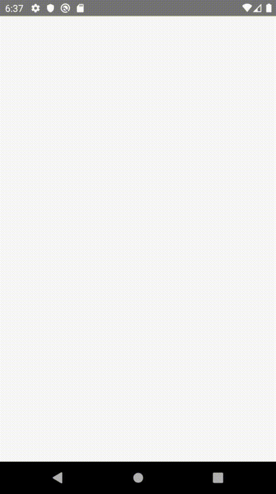
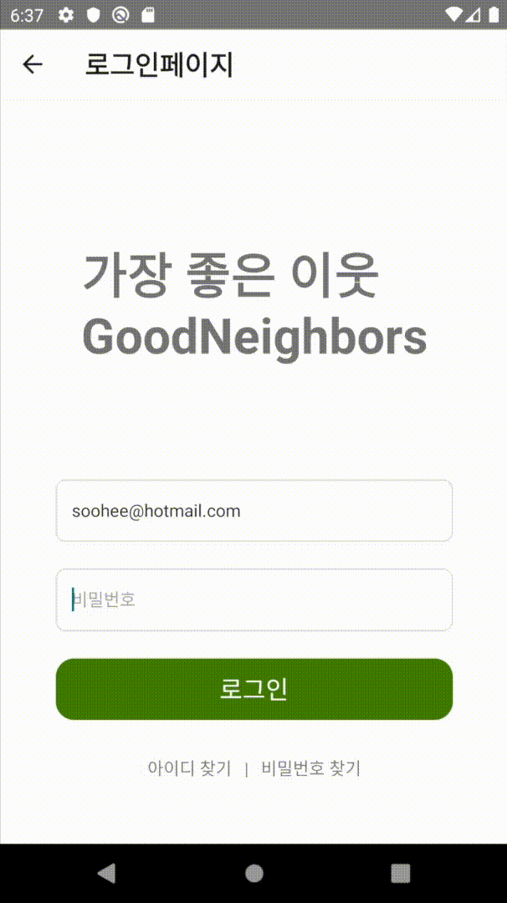

# GoodNeighbors

### Good change for the world

글로벌 아동권리 전문 NGO 앱을 후원자들이 커뮤니티를 형성하여 활동하도록하여

후원 및 캠페인에 다양하게 참여할 수 있도록 만든 **후원자 친화적 앱**입니다.

<a href="">
<a href="https://www.figma.com/file/hKmyJgRc19ks8BKj5MD13M/GoodNeighbors?node-id=0%3A1">

## 프로젝트 진행 기간 및 팀원소개

## 사용스택

## 주요기능

1. 로그인

**Splash Screen** / **graphQL Login** / **Google social Login**

    
    
    

react-native-splash-screen을 사용하여 splash screen 구현

graphQL API로 Login

firebase Authentication 활용하여 Google Social Login 구현

2. 홈

**Home Main** / **Home Detail** / **Home Children**

    
    
    

react-top-navigation으로 캠페인/결연아동/정기후원 섹션으로 분기

progress bar 제작 - 각 캠페인/정기후원의 목표달성 정도를 보여줌

각 아이템 디테일 페이지에서 비슷한 아이템 추천하여 참여자의 관심도에 따른 아이템에 참여하도록 구현

결연아동 디테일 페이지에서는 아동에게 편지를 댓글 형식으로 작성

**Home Payment** / **Home Search**

    
    

    

아임포트 결제 연결

3. 커뮤니티

4. 뉴스

5. 마이페이지
