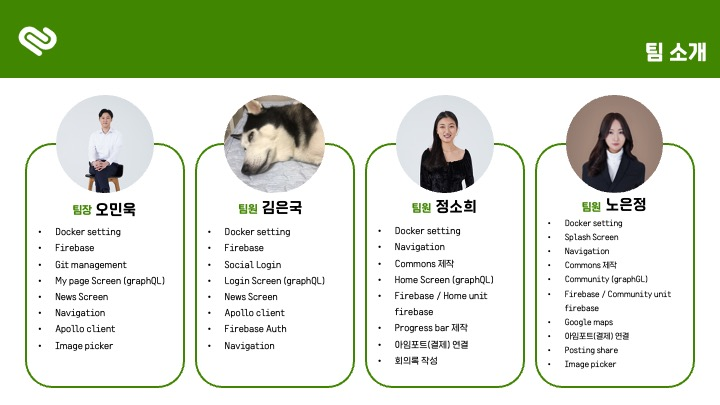
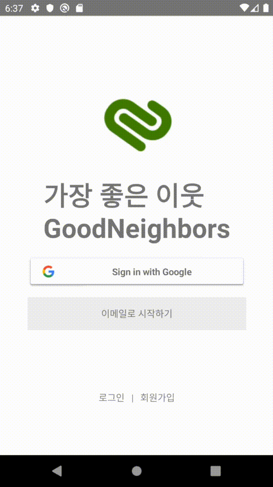

# GoodNeighbors

### Good change for the world

글로벌 아동권리 전문 NGO 앱을 후원자들이 커뮤니티를 형성하여 활동하도록하여

후원 및 캠페인에 다양하게 참여할 수 있도록 만든 **후원자 친화적 앱**입니다.

<a href="">
<a href="https://www.figma.com/file/hKmyJgRc19ks8BKj5MD13M/GoodNeighbors?node-id=0%3A1">

## 프로젝트 진행 기간 및 팀원소개

## 사용스택

## 주요기능

1. 로그인

**Splash Screen** / **graphQL Login** / **Google social Login**

    
    
    

2. 홈

3. 커뮤니티

4. 뉴스

5. 마이페이지
